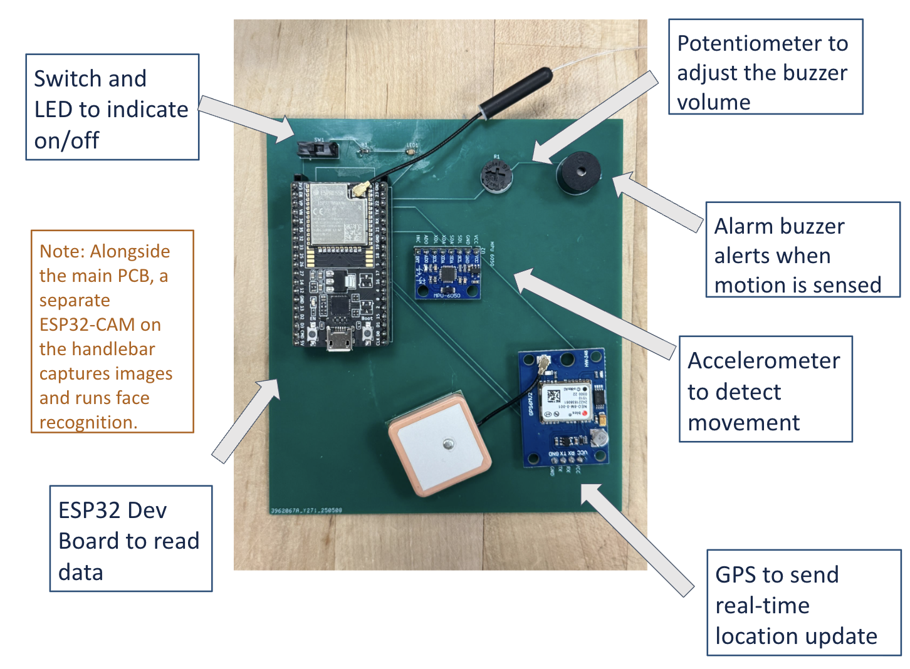

# Micro-Mobility Device Tracker Firmware

This repository contains the firmware for our [Micro-Mobility Device Tracker](https://github.com/Serenity0204/Micro-mobility-device-tracker)

## Components
### 1. Main Firmware
- **Framework**: ESP-IDF
- **Functionality**:
  - Detects movement using the MPU6050 sensor
  - Gets location data from a NEO-6M GPS module
  - Sends data to a remote server via Wi-Fi
  - Integrates different tasks using FreeRTOS

### 2. Camera Firmware (`cam/`)
- **Framework**: Arduino (ESP32-CAM)
- **Functionality**:
  - Captures and streams images on demand
  - Communicates with the server to send streaming data or images.

## Hardware Used
- ESP32 DevKitC Wroom32UE
- ESP32 Cam board
- MPU6050 motion sensor
- NEO-6M GPS module
- Active Buzzer  

## Usage
1. Flash the `main` firmware to the main devboard.
2. Flash the `cam` firmware to the camera board.
3. Configure Wi-Fi and server settings
4. Power both devices.
